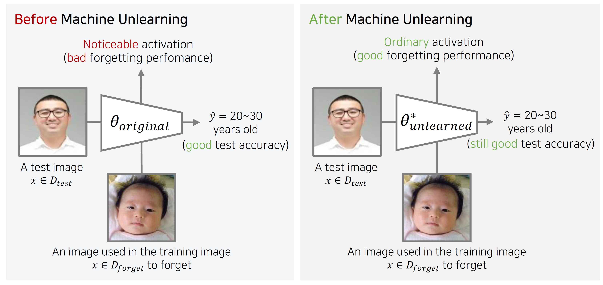
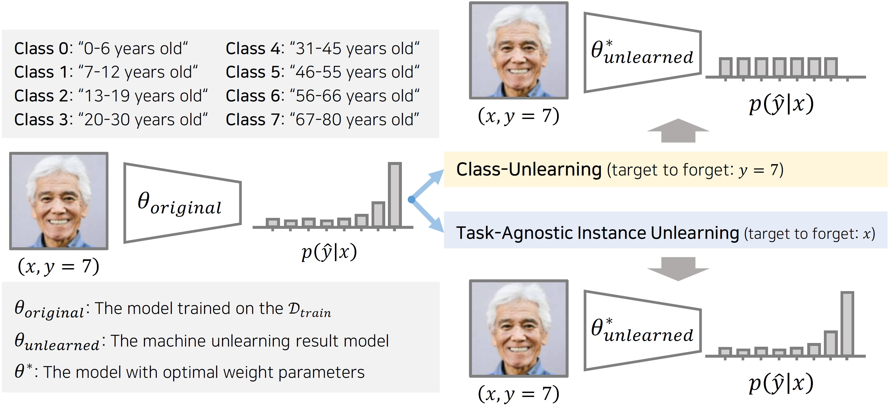
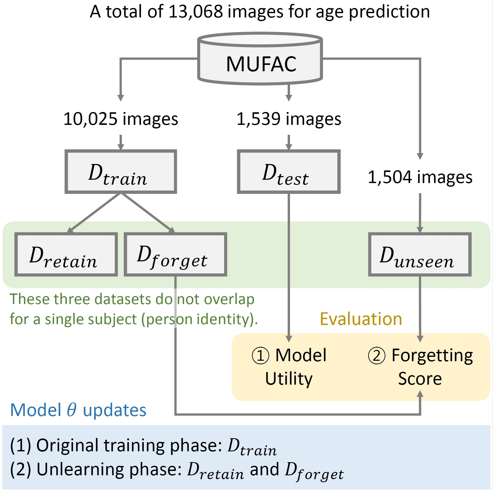
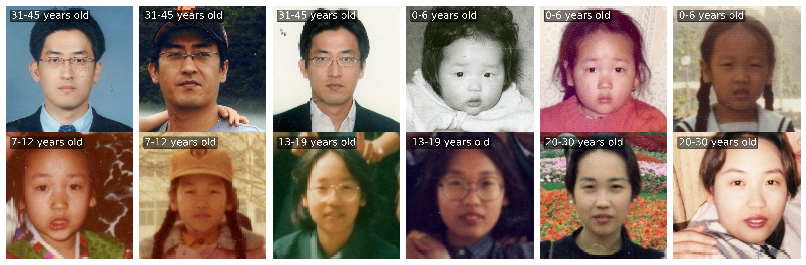
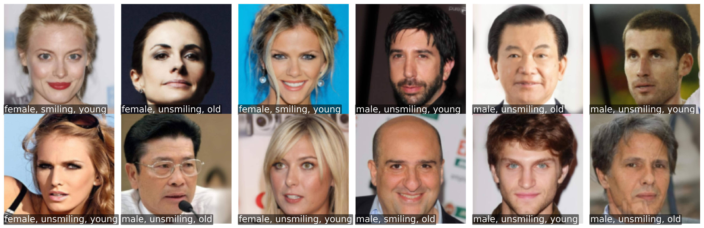

### Towards Machine Unlearning Benchmarks: Forgetting the Personal Identities in Facial Recognition Systems
* This repository provides **practical benchmark datasets** and **PyTorch implementations for Machine Unlearning**, enabling the construction of privacy-crucial AI systems by forgetting specific data instances without changing the original model utility.

### Authors
[Dasol Choi](https://github.com/Dasol-Choi), [Dongbin Na](https://github.com/ndb796)

#### Abstract
> Machine unlearning is a crucial tool for enabling a classification model to forget specific data that are used in the training time. Recently, various studies have presented machine unlearning algorithms and evaluated their methods on several datasets. However, most of the current machine unlearning algorithms have been evaluated solely on traditional computer vision datasets such as CIFAR-10, MNIST, and SVHN. Furthermore, previous studies generally evaluate the unlearning methods in the class-unlearning setup. Most previous work first trains the classification models and then evaluates the machine unlearning performance of machine unlearning algorithms by forgetting selected image classes (categories) in the experiments. Unfortunately, **these class-unlearning settings might not generalize to real-world scenarios.** In this work, we propose a machine unlearning setting that aims to unlearn specific instance that contains personal privacy (identity) **while maintaining the original task of a given model.** Specifically, we propose two machine unlearning benchmark datasets, **MUFAC** and **MUCAC**, that are greatly useful to evaluate the performance and robustness of a machine unlearning algorithm. In our benchmark datasets, the original model performs facial feature recognition tasks: face age estimation (multi-class classification) and facial attribute classification (binary class classification), where a class does not depend on any single target subject (personal identity), which can be a realistic setting. Moreover, we also report **the performance of the state-of-the-art machine unlearning methods on our proposed benchmark datasets.**

#### <b>Task-Agnostic Machine Unlearning</b>

* The conceptual illustration of our proposed task-agnostic unlearning setup:

* Comparison with the traditional class-unlearning:

#### Datasets

* The illustration of our MUFAC benchmark:

* [**MUFAC** (Machine Unlearning for Facial Age Classifier)](https://postechackr-my.sharepoint.com/:u:/g/personal/dongbinna_postech_ac_kr/EbMhBPnmIb5MutZvGicPKggBWKm5hLs0iwKfGW7_TwQIKg)
  * A multi-class age classification dataset based on AI HUB, featuring over 13,000 Asian facial images with annotations for age groups and personal identities, ideal for machine unlearning research.
 

 
* [**MUCAC** (Machine Unlearning for Celebrity Attribute Classifier)](https://github.com/ndb796/CelebA-HQ-Face-Identity-and-Attributes-Recognition-PyTorch)
  * A multi-label facial attribute classification dataset based on CelebA, expanded to 30,000 images and enriched with personal identity annotations to support unlearning algorithms.
 

#### Evaluation Metrics

Our machine unlearning Benchmark is evaluated on two key aspects: **model utility** and **forgetting performance**. Here's how we measure them:

* **Model Utility**
  - **Accuracy**: The primary metric for model utility is the accuracy of the classification task, defined as the probability of the model's predictions matching the true labels in the test dataset.

* **Forgetting Score**
  - **Membership Inference Attack (MIA)**: To assess how well the model forgets, we use MIA, where the goal is to infer if specific data was used during training. A binary classifier is trained to distinguish between (1) data to be forgotten and (2) unseen data, with the ideal accuracy being 0.5, indicating perfect unlearning.

* **Normalized Machine Unlearning Score (NoMUS)**
  - **Combined Metric**: NoMUS is introduced to evaluate unlearning performance, combining (1) model utility and (2) forgetting score. It is a weighted sum where 'lambda' balances the importance of model utility against forgetting performance. The NoMUS score ranges between 0 (worst) and 1 (best), with higher scores indicating better unlearning.

#### Source Codes

|MUFAC (multi-task)| [Total Experiments](https://github.com/ndb796/MachineUnlearning/blob/main/01_MUFAC/Machine_Unlearning_MUFAC_Full_Experiments.ipynb) | [Base Models (Original, Retrained)](https://github.com/ndb796/MachineUnlearning/blob/main/01_MUFAC/Machine_Unlearning_MUFAC_Base_Models.ipynb) |  [Fine-tuning(Standard Fine-tuning, CF-3)](https://github.com/ndb796/MachineUnlearning/blob/main/01_MUFAC/Machine_Unlearning_MUFAC_FineTuing.ipynb)   | [NegGrad(Standard NegGrad, Advanced NegGrad)](https://github.com/ndb796/MachineUnlearning/blob/main/01_MUFAC/Machine_Unlearning_MUFAC_NegGrad.ipynb) | [UNSIR](https://github.com/ndb796/MachineUnlearning/blob/main/01_MUFAC/Machine_Unlearning_MUFAC_UNSIR.ipynb)  | [SCRUB](https://github.com/ndb796/MachineUnlearning/blob/main/01_MUFAC/Machine_Unlearning_MUFAC_SCRUB.ipynb) |
|------------------|------------------|--------------------------------------------------|-------|-------------|-----------------|-------|
|**
MUCAC (multi-label)
**| [
**Total Experiments**
](https://github.com/ndb796/MachineUnlearning/blob/main/02_MUCAC/multi_label_classification/Machine_Unlearning_MUCAC_Multi_Label_Full_Experiments.ipynb) | [
**Base Models (Original, Retrained)**
](https://github.com/ndb796/MachineUnlearning/blob/main/02_MUCAC/multi_label_classification/Machine_Unlearning_MUFAC__Multi_Label_Base_Models.ipynb) |  [
**Fine-tuning(Standard Fine-tuning, CF-3)**
](https://github.com/ndb796/MachineUnlearning/blob/main/02_MUCAC/multi_label_classification/Machine_Unlearning_MUCAC__Multi_Label_FineTuning.ipynb)   | [
**NegGrad(Standard NegGrad, Advanced NegGrad)**
](https://github.com/ndb796/MachineUnlearning/blob/main/02_MUCAC/multi_label_classification/Machine_Unlearning_MUCAC_Multi_Label_NegGrad.ipynb) | [**UNSIR**](https://github.com/ndb796/MachineUnlearning/blob/main/02_MUCAC/multi_label_classification/Machine_Unlearning_MUCAC_Multi_Label_UNSIR.ipynb)  | [**SCRUB**](https://github.com/ndb796/MachineUnlearning/blob/main/02_MUCAC/multi_label_classification/Machine_Unlearning_MUCAC_Multi_Label_SCRUB.ipynb) |
|**
MUCAC (binary-class)
**| [
**Total Experiments**
](https://github.com/ndb796/MachineUnlearning/blob/main/02_MUCAC/binay_classification/Machine_Unlearning_MUCAC_Binary_Cls_Full_Experiments.ipynb) | [
**Base Models (Original, Retrained)**
](https://github.com/ndb796/MachineUnlearning/blob/main/02_MUCAC/binay_classification/Machine_Unlearning_MUCAC_Binary_Cls_Base_Models.ipynb) |  [
**Fine-tuning(Standard Fine-tuning, CF-3)**
](https://github.com/ndb796/MachineUnlearning/blob/main/02_MUCAC/binay_classification/Machine_Unlearning_MUCAC_Binary_Cls_FineTuning.ipynb)   | [
**NegGrad(Standard NegGrad, Advanced NegGrad)**
](https://github.com/ndb796/MachineUnlearning/blob/main/02_MUCAC/binay_classification/Machine_Unlearning_MUCAC_Binary_Cls_NegGrad.ipynb) | [**UNSIR**](https://github.com/ndb796/MachineUnlearning/blob/main/02_MUCAC/binay_classification/Machine_Unlearning_MUCAC_Binary_Cls_UNSIR.ipynb)  | [**SCRUB**](https://github.com/ndb796/MachineUnlearning/blob/main/02_MUCAC/binay_classification/Machine_Unlearning_MUCAC_Binary_Cls_SCRUB.ipynb) |

#### Models Performance 
> Detailed performance comparisons of various state-of-the-art unlearning methods applied to our **MUFAC** and **MUCAC** datasets, using a ResNet18 model trained from scratch.

 [Download Original Models for Implementations](https://drive.google.com/drive/folders/1PCj-f2KV7XDiQJEzce0aDRasmjVkb9CN?usp=sharing)
 
1. Overall Performance for <b>Multi-classification</b> on <b>MUFAC</b>

| Metrics                         | Original | Retrained | Fine-tuning | CF-3  | Grad Asc | UNSIR Stage 1 | UNSIR Stage 2 | SCRUB | Advanced Grad Asc |
|---------------------------------|----------|-----------|-------------|-------|----------|---------------|---------------|-------|-------------------|
| 
Test Acc
        | 
0.5951
 | 
0.488
  | 
0.6055
 | 
0.5900
   | 
0.4048
 | 
0.5893
       | 
0.5925
       | 
0.5984
 | 
0.5633
          |
| 
Top-2 Test Acc
  | 
0.8804
 | 
0.7667
 | 
0.8869
 | 
0.8804
 | 
0.5932
 | 
0.8778
       | 
0.8674
       | 
0.8745
 | 
0.8557
          |
| 
MIA
             | 
0.2136
 | 
0.0445
 | 
0.2129
 | 
0.2126
 | 
0.0485
 | 
0.2089
       | 
0.1990
        | 
0.1415
 | 
0.0953
          |
| 
Final Score
     | 
0.5839
| 
0.6995
  | 
0.5898
| 
0.5824
 | 
0.6539
 | 
0.5857
      | 
0.5972
      | 
0.6577
 | 
0.6863
         |

 

&nbsp;&nbsp;2-1. Overall Performance for <b>Multi-label</b> on <b>MUCAC</b> 
  
| Metrics                         | Original | Retrained | Fine-tuning | CF-3  | Grad Asc | UNSIR Stage 1 | UNSIR Stage 2 | SCRUB | Advanced Grad Asc |
|---------------------------------|----------|-----------|-------------|-------|----------|---------------|---------------|-------|-------------------|
| 
Test Acc
        | 
0.8852
  | 
0.8135
  | 
0.9147
 | 
0.9197
 | 
0.4193
 | 
0.7087
        | 
0.9220
          | 
0.9073
  | 
0.7607
          |
| 
MIA
             | 
0.0568
  | 
0.0436
  | 
0.0708
 | 
0.0685
 | 
0.0356
 | 
0.0324
        | 
0.0705
          | 
0.0478
  | 
0.0152
          |
| 
Final Score
     | 
0.8858
  | 
0.8631
 | 
0.8865
 | 
0.8913
 | 
0.6740
 | 
0.8219
       | 
0.8905
          | 
0.9058
 | 
0.8651
         |

 

&nbsp;&nbsp;2-2. Overall Performance for <b>Binary-classification</b> on <b>MUCAC</b> 
* Male & Female
  
| Metrics                         | Original | Retrained | Fine-tuning | CF-3  | Grad Asc | UNSIR Stage1 | UNSIR Stage2 | SCRUB | Advanced Grad Asc |
|---------------------------------|----------|-----------|-------------|-------|----------|---------------|---------------|-------|-------------------|
| 
Test Acc
        | 
0.9835
  | 
0.9515
  | 
0.9849
 | 
0.9840
   | 
0.1762
 | 
0.9481
       | 
0.9845
       | 
0.1762
 | 
0.9147
          |
| 
MIA
             | 
0.0306
  | 
0.0154
  | 
0.0281
 | 
0.0291
 | 
0.1289
 | 
0.0638
       | 
0.0481
       | 
0.1329
 | 
0.0129
          |
| 
Final Score
     | 
0.9611
 | 
0.9603
 | 
0.9643
 | 
0.9629
 | 
0.4592
 | 
0.9102
      | 
0.9441
      | 
0.4552
 | 
0.9444
         |

  * Smiling & Unsmiling

| Metrics                         | Original | Retrained | Fine-tuning | CF-3   | Grad Asc | UNSIR Stage1 | UNSIR Stage2 | SCRUB | Advanced Grad Asc |
|---------------------------------|----------|-----------|-------------|--------|----------|---------------|---------------|-------|-------------------|
| 
Test Acc
        | 
0.9467
  | 
0.6518
   | 
0.9476
  | 
0.9472
 | 
0.5549
  | 
0.8619
       | 
0.9506
       | 
0.5549
 | 
0.9423
          |
| 
MIA
             | 
0.0346
  | 
0.0182
   | 
0.0279
  | 
0.0294
 | 
0.0366
  | 
0.0416
       | 
0.0271
       | 
0.468
  | 
0.0354
          |
| 
Final Score
     | 
0.9387
 | 
0.8077
   | 
0.9459
  | 
0.9442
 | 
0.7408
 | 
0.8893
      | 
0.9482
       | 
0.3094
| 
0.9357
         |

  * Young & Old
    
| Metrics                         | Original | Retrained | Fine-tuning | CF-3   | Grad Asc | UNSIR Stage1 | UNSIR Stage2 | SCRUB | Advanced Grad Asc |
|---------------------------------|----------|-----------|-------------|--------|----------|---------------|---------------|-------|-------------------|
| 
Test Acc
        | 
0.9089
  | 
0.8271
   | 
0.9147
  | 
0.9118
 | 
0.1733
  | 
0.826
        | 
0.9021
       | 
0.8929
 | 
0.5573
          |
| 
MIA
             | 
0.0456
  | 
0.0234
   | 
0.0426
  | 
0.0456
 | 
0.0513
  | 
0.0229
       | 
0.0493
       | 
0.0428
  | 
0.0139
          |
| 
Final Score
     | 
0.9088
 | 
0.8901
  | 
0.9147
 | 
0.9103
 | 
0.5353
 | 
0.8901
       | 
0.9017
      | 
0.9036
| 
0.7647
         |

#### Citation
> To be continued...
